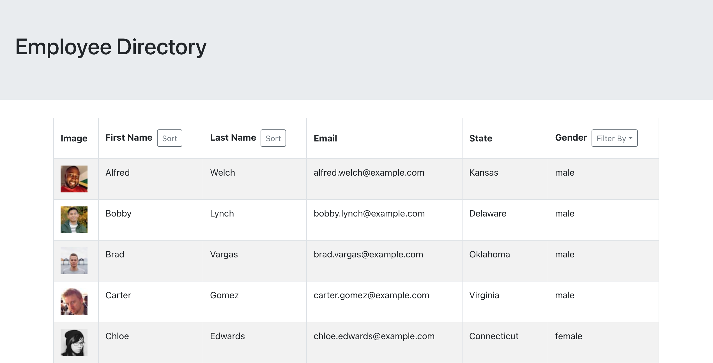

# Employee Directory
[](https://opensource.org/licenses/MIT)

## Table of Contents
  - [Table of Contents](#table-of-contents)
  - [Description](#description)
  - [Links](#links)
  - [Installation](#installation)
  - [Resources](#resources)
  - [License](#license)

## Description

Employee Directory is a web application that allows an employee or manager to view non-sensitive data about other employees. The user can sort and filter employees by name and gender. The application uses random users generated from the [Random User API](https://randomuser.me/); when the user loads the page, a table of employees  render. 



## Links
- [Repository](https://github.com/elliefh/employee-directory)
- [Deployed]()

## Installation
The following command should be run to install necessary dependencies: 
```bash
npm i
```

## Resources
- React.js
- React Bootstrap
- Random User API
- Bobbi Tarkany 

## License

Copyright (c) [2021] [Ellie Fu-Hinthorn]

Permission is hereby granted, free of charge, to any person obtaining a copy
of this software and associated documentation files (the "Software"), to deal
in the Software without restriction, including without limitation the rights
to use, copy, modify, merge, publish, distribute, sublicense, and/or sell
copies of the Software, and to permit persons to whom the Software is
furnished to do so, subject to the following conditions:

The above copyright notice and this permission notice shall be included in all
copies or substantial portions of the Software.

THE SOFTWARE IS PROVIDED "AS IS", WITHOUT WARRANTY OF ANY KIND, EXPRESS OR
IMPLIED, INCLUDING BUT NOT LIMITED TO THE WARRANTIES OF MERCHANTABILITY,
FITNESS FOR A PARTICULAR PURPOSE AND NONINFRINGEMENT. IN NO EVENT SHALL THE
AUTHORS OR COPYRIGHT HOLDERS BE LIABLE FOR ANY CLAIM, DAMAGES OR OTHER
LIABILITY, WHETHER IN AN ACTION OF CONTRACT, TORT OR OTHERWISE, ARISING FROM,
OUT OF OR IN CONNECTION WITH THE SOFTWARE OR THE USE OR OTHER DEALINGS IN THE
SOFTWARE.